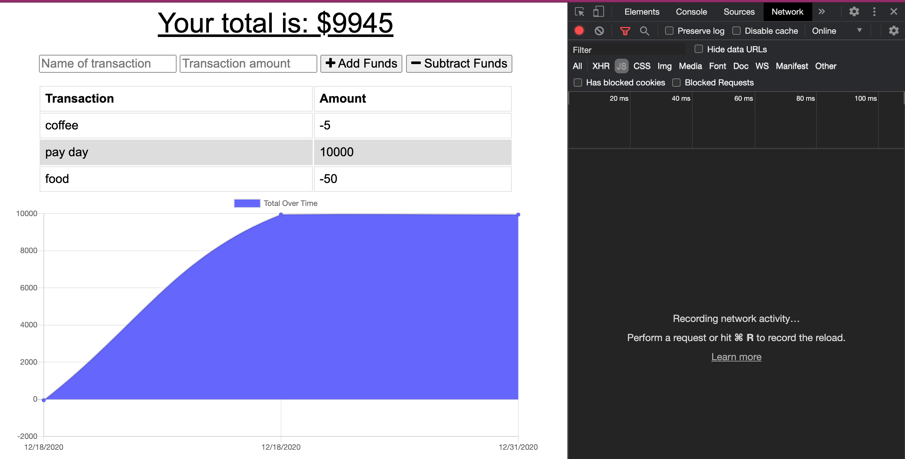
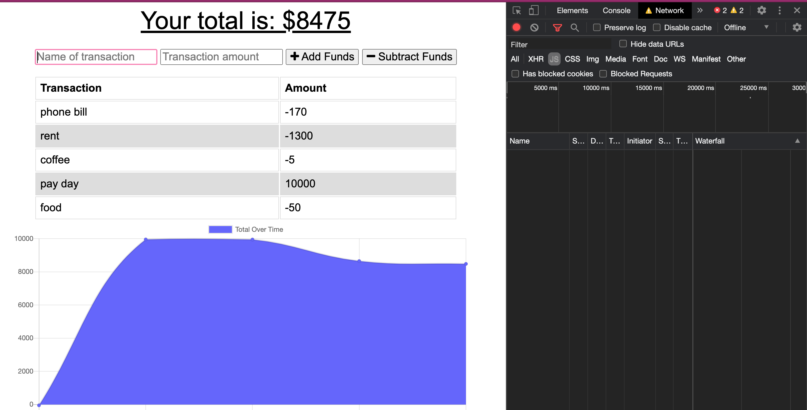
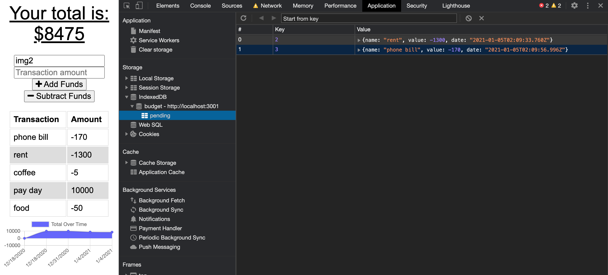

# progressiveBudget

    Functioning app

    Functioning app while offline

    Pending data - will populate once online

## Description

This app allows users to keep track of their spending. The user will be able to track their spending and the money they earn. The user will be able to add expenses and deposits to their budget tracker with or without a connection. The transactions entered while the connection was offline will populate the total when the connection is back online. 

## Table of Contents

* [Installation](#installation)
* [Questions](#questions)

## Installation

The command that should be run to install dependencies is: 
`npm i` and `npm start`

## Questions

If you have any further questions regarding this project, please feel free to contact.

GitHub Username: ashvinit
Email Address: ashvinithomas@gmail.com

